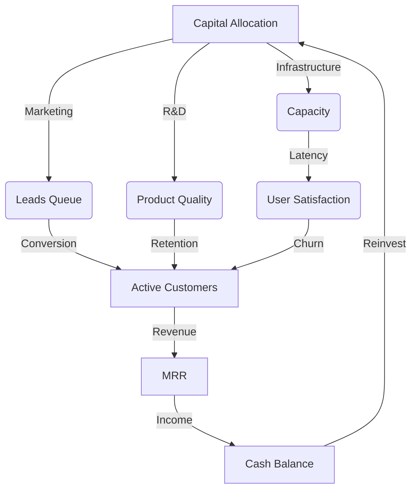

# 🪐 StratOS-RL: The SaaS Strategic RL Benchmark

[](https://github.com/openenv/spec)
[](https://opensource.org/licenses/MIT)
[](https://www.python.org/downloads/)

**StratOS-RL** is a high-fidelity reinforcement learning environment designed to evaluate an agent's ability to manage complex, non-linear economic systems. Unlike traditional control tasks, StratOS-RL focuses on **Long-Horizon Planning**, **Delayed Feedback Loops**, and **Multi-Objective Resource Allocation**.

---

## 🔬 The Scientific Challenge: "Temporal Credit Assignment in Stochastic Economies"

StratOS-RL is specifically engineered to be **insolvable by simple reactive agents**. It presents a "Hard AI" problem through three core mechanisms:

1.  **Stochastically Lagged Queues**: Marketing spend and R&D don't yield results immediately. We implement **Multi-Phase Leads Queues** and **Brand Momentum** decay models, forcing agents to value delayed rewards.
2.  **Human Capital Latency**: Hiring isn't instant. New employees enter a **3-step Training Queue**, creating a "Burn-before-Value" period that tests long-horizon liquidity management.
3.  **The Credit Squeeze Paradox**: High-growth strategies often lead to liquidity crises. The environment implements a "Lender Trust" metric that non-linearly scales interest rates and bankruptcy risk based on historical burn rates.

### The Economic Flywheel


---

## 🛠️ Installation & Setup

### 1. Clone & Install
```bash
git clone https://github.com/your-username/stratos-rl.git
cd stratos-rl
pip install -e .
```

### 2. Launch the Environment Server
StratOS-RL uses an OpenEnv-compliant FastAPI server architecture.
```bash
# Start the local environment
python -m server.app
```

### 3. Run a Baseline Agent
```bash
python inference.py
```

---

## 🎯 Evaluation Tasks

StratOS-RL includes three deterministic evaluation scenarios:

| Task ID | Name | Difficulty | Objective |
| :--- | :--- | :--- | :--- |
| `task-1-growth` | **Bootstrapping 101** | Easy | Scaling MRR from $0 to $10k with limited initial capital. |
| `task-2-viral` | **The Viral Crash** | Medium | Managing a sudden 10x influx of traffic without collapsing infrastructure or quality. |
| `task-3-price` | **The Efficiency War** | Hard | Optimizing LTV/CAC in a mature, high-churn market with aggressive competitors. |

---

## 📊 Environment Specification

### Observation Space (`StratosObservation`)
The agent receives a full "CEO Dashboard" every step (1 month per step):
- `bank`: Current Cash and Monthly Recurring Revenue (MRR).
- `aws`: Infrastructure capacity vs. real-time utilization.
- `analytics`: Customer Acquisition Cost (CAC) and Lifetime Value (LTV).
- `market`: Brand strength and market share metrics.

### Action Space (`StratosAction`)
The agent must allocate resources across 6 dimensions:
- `price`: Subscription pricing strategy.
- `a_marketing`: Direct customer acquisition spend.
- `a_product`: R&D and product quality investment.
- `a_infra`: Server and infrastructure expansion.
- `a_hiring`: Talent acquisition and team scaling.
- `a_debt_repayment`: Financial liability management.

---
## 📊 Baseline Performance

The environment has been validated using a zero-shot LLM agent (`gpt-4o-mini`) with a strategic system prompt.

| Task ID | Model | Steps | Score | Status |
| :--- | :--- | :--- | :--- | :--- |
| `task-1-growth` | `gpt-4o-mini` | 25 | **0.692** | ✅ Passed |
| `task-2-viral` | `gpt-4o-mini` | 20 | **0.665** | ✅ Passed |
| `task-3-price` | `gpt-4o-mini` | 18 | **0.469** | ⚡ Failed |

> [!TIP]
> **Scientific Insight**: The baseline results demonstrate that while current LLMs can handle linear growth (Task 1), they struggle with **high-fixed-cost insolvency traps** (Task 3). The 3-month hiring lag in Task 3 proved fatal for the agent, which failed to anticipate the 'burn-before-revenue' period, leading to a liquidity death spiral. This confirms StratOS-RL as a valid benchmark for long-horizon strategic reasoning.

> [!NOTE]
> This environment is built for **OpenEnv compliance**. It provides a deterministic grader and standardized server/client interfaces for fair benchmarking.
